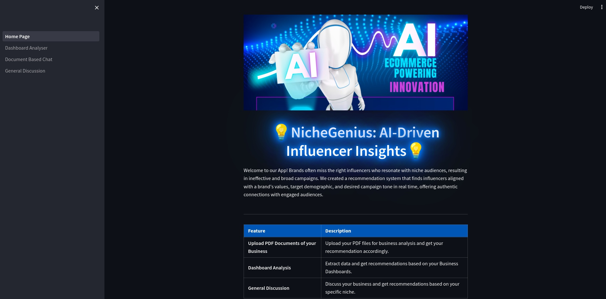
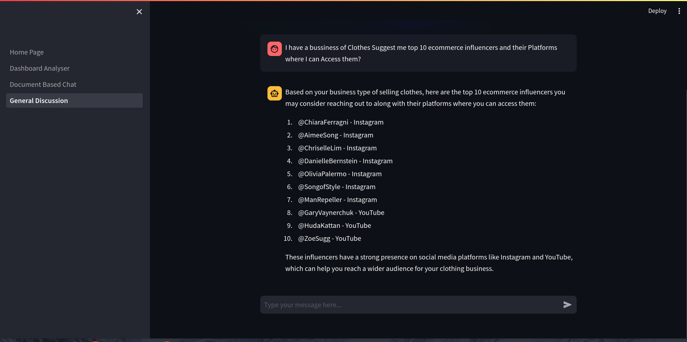
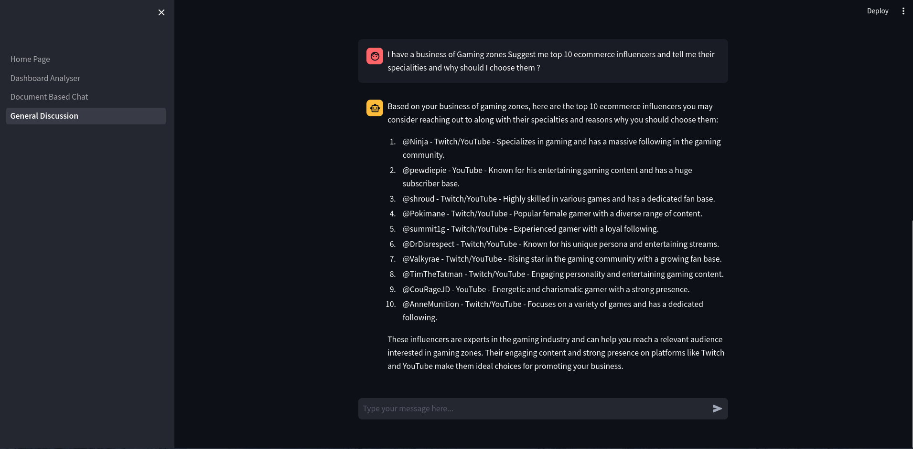
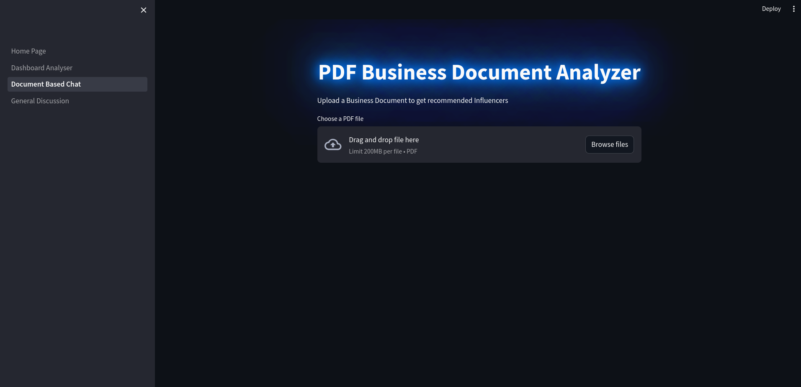
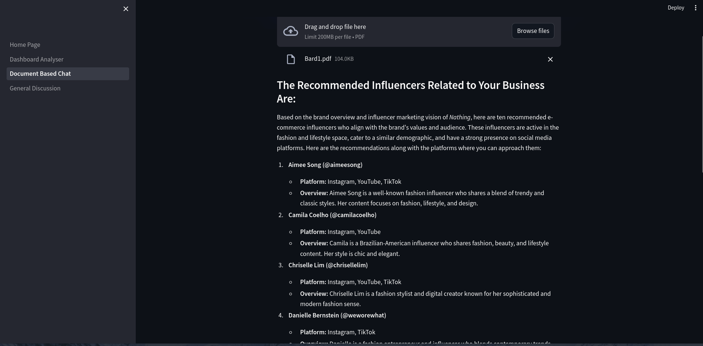
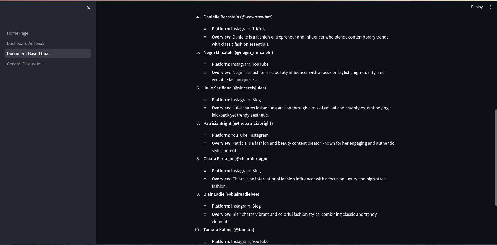
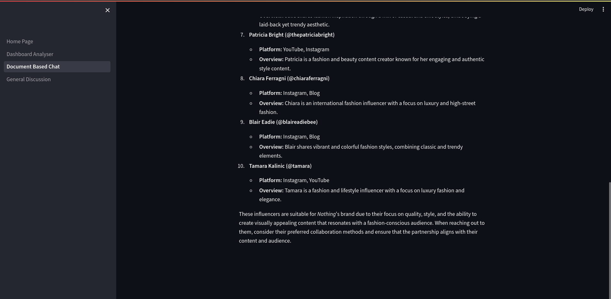
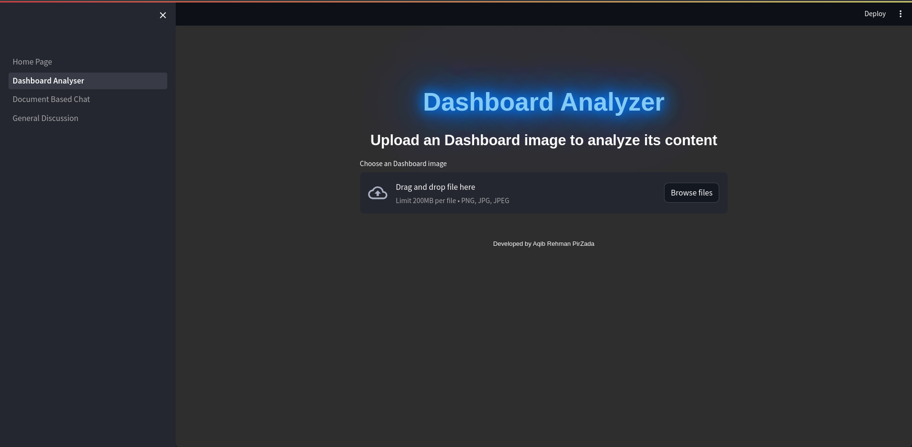
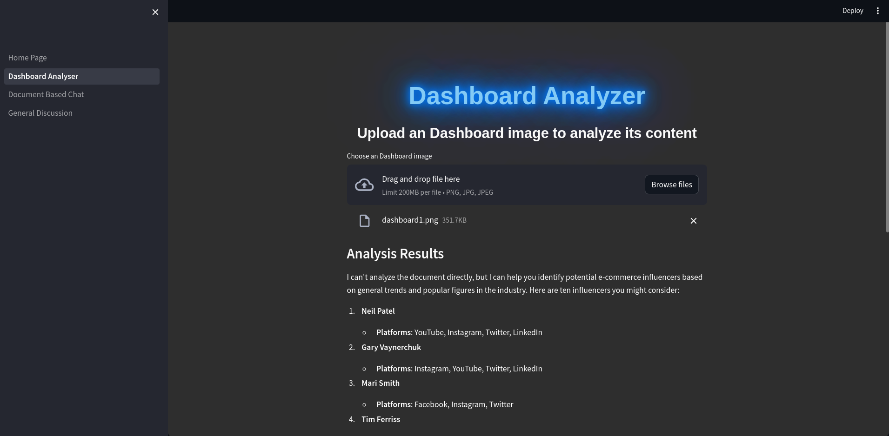
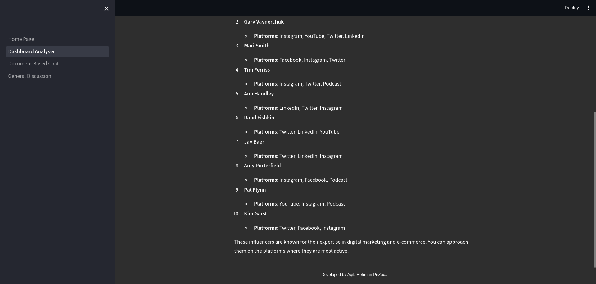

# 💡 NicheGenius: AI-Driven Influencer Insights 💡

A Streamlit-based web application that helps businesses and marketers identify the most suitable influencers for their niche market in real-time. This app leverages advanced recommendation algorithms and data analysis techniques to provide insights that help make data-driven decisions for influencer marketing.

## 🚀 Features
1. **Prompt-Based Influencer Matching**:  
   Users can enter prompts like _"I need influencers for my sportswear brand"_, and the system intelligently generates a list of influencers who align with the brand’s target audience and goals.

2. **Document Business Analysis and Suggestions**:  
   Leveraging data analytics, the system analyzes brand objectives, market trends, and audience demographics to recommend the best influencers, ensuring alignment and maximizing ROI.

3. **Interactive Dashboards Summarization**:  
   Users receive AI-generated summaries of dashboards, highlighting key metrics from e-commerce and influencer activities. This feature simplifies complex data into clear, actionable insights.

## 📦 Installation

To run this app locally, follow these steps:

1. Clone the repository:

   ```bash
   git clone https://github.com/aqibrehmanpirzada/NicheGenius-AI-Driven-Influencer-Insights.git
   cd NicheGenius-AI-Driven-Influencer-Insights
   ```

2. Create a virtual environment:

   ```bash
   python -m venv myenv
   ```

3. Activate the virtual environment:

   - **Windows:**
     ```bash
     myenv\Scripts\activate
     ```
   - **macOS/Linux:**
     ```bash
     source myenv/bin/activate
     ```

4. Install the required packages:

   ```bash
   pip install -r requirements.txt
   ```

5. Run the Streamlit app:

   ```bash
   streamlit run app.py
   ```

6. Open your browser and go to `http://localhost:8501` to access the app.

## 🛠 Usage

1. **Upload Data**: Upload influencer data in CSV format to get personalized recommendations.
2. **Set Filters**: Adjust filters such as follower count, engagement rate, niche categories, and more.
3. **View Recommendations**: Get a list of recommended influencers tailored to your selected niche.
4. **Analyze**: Use the provided analytics and visualizations to make informed decisions.

## 🧠 Recommendation Algorithm

The recommendation engine is powered by advanced LLM GPT-4o that analyze various metrics such as:

- **Engagement Rate**
- **Content Niche Alignment**
- **Influencer Authenticity**
  
This ensures that the recommendations are not only relevant but also data-driven.

## 🎨 Screenshot













## 📝 Requirements

- Python 3.8+
- Streamlit 
- langchain
- langchain
- langchain_community
- langchain_core
- langchain_openai
- pypdf

(You can see the full list of dependencies in `requirements.txt`.)

## 🤝 Contributing

Contributions are welcome! Please follow these steps:

1. Fork the repository.
2. Create a new branch (`git checkout -b feature/YourFeature`).
3. Commit your changes (`git commit -m 'Add some feature'`).
4. Push to the branch (`git push origin feature/YourFeature`).
5. Open a pull request.

## 📄 License

This project is licensed under the MIT License - see the [LICENSE](LICENSE) file for details.

## 🙋‍♂️ Support

If you encounter any issues or have questions, feel free to reach out via [GitHub Issues](https://github.com/aqibrehmanpirzada/Realtime-Influencer-Recommendation-System-Using-GPT-4o/issues).

## ⭐ Acknowledgments

- Inspired by the need for effective influencer marketing tools.
- Built with the amazing [Streamlit](https://streamlit.io) framework.
- Special thanks to the open-source community for their contributions!
